# Orbitalis

**Orbitalis** is a **distributed**, **event-based micro-kernel** library for Python designed to simplify the construction of *loosely coupled, scalable, and modular systems*.

At its core, Orbitalis provides a lightweight yet powerful foundation for building event-driven applications using an event bus mechanism. It integrates natively with [Busline](https://github.com/orbitalis-framework/py-busline), a flexible and efficient event bus library that handles message distribution across system components, whether local or distributed.

If you don't want to read the user guide, you can skip to [Practical Example](#practical-example).


## User Guide

In this section we will explain how to use Orbitalis. If you want to know more details about this library, please read the [Advance Guide](#advance-guide). 

Every time-based values are expressed in seconds, because `asyncio.sleep` is used.

### Preliminary: Busline

If you know what [Busline](https://github.com/orbitalis-framework/py-busline) is, you can skip this section.

[Busline](https://github.com/orbitalis-framework/py-busline) is an agnostic asynchronous pub/sub library, which represents a good starting point to implement a wide set of application thanks to its pub/sub abstract layer.

It natively supports MQTT and Local event bus and you should know how to create pub/sub clients in order to allow your components to share messages.

We advice to read [Busline](https://github.com/orbitalis-framework/py-busline) documentation before continue.

### Overview

Orbitalis follows the **micro-kernel** (a.k.a. [**Plugin**](#plugin)) architectural pattern, where a minimal [**Core**](#core) (the kernel) handles only the essential system functions—like loading and managing modules, and routing events—while all additional features are implemented as independent [**Plugins**](#plugin) that interact via the event bus.

This design brings several advantages:

- **Separation of Concerns**: Each module is self-contained and focused on a specific task or domain
- **Extensibility**: New features can be added without modifying the core, reducing the risk of breaking existing functionality
- **Flexibility**: Modules can be enabled, disabled, or replaced at runtime
- **Maintainability**: Smaller code units are easier to test, debug, and reuse
- **Scalability**: Modules can be distributed across processes or machines and communicate via events


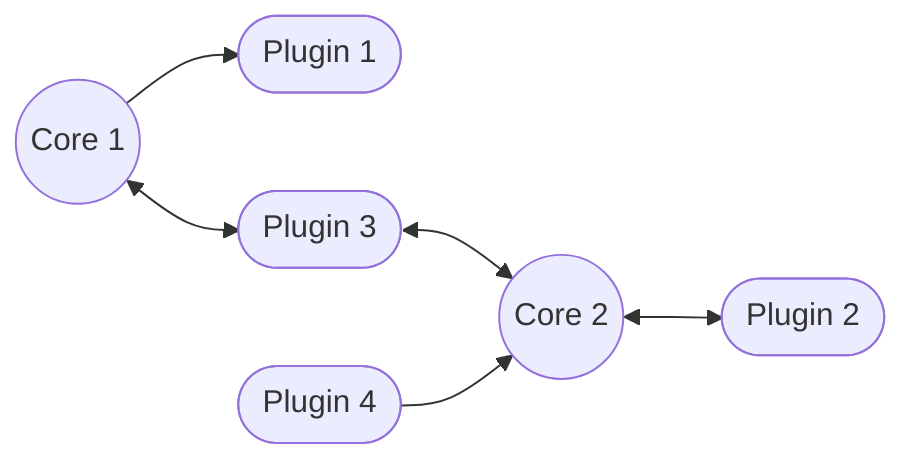

Orbitalis allows to have more Cores and more Plugins, even in *different domains* thanks to [Busline](https://github.com/orbitalis-framework/py-busline) capabilities, which can be instantiate **at runtime** thanks to a powerful [handshake mechanism](#handshake). In fact, for example, we can have some plugins connected with MQTT and other with a Local event bus at the same time.
This allows you a powerful management of your components.

In other words, Orbitalis allows you to start cores and plugins, connect them together and execute plugin operations.
Cores and plugins can be started in any time and connections are created based on pre-defined policies.

Messages used by Orbitalis are **Avro messages** because we need input and output schemas.

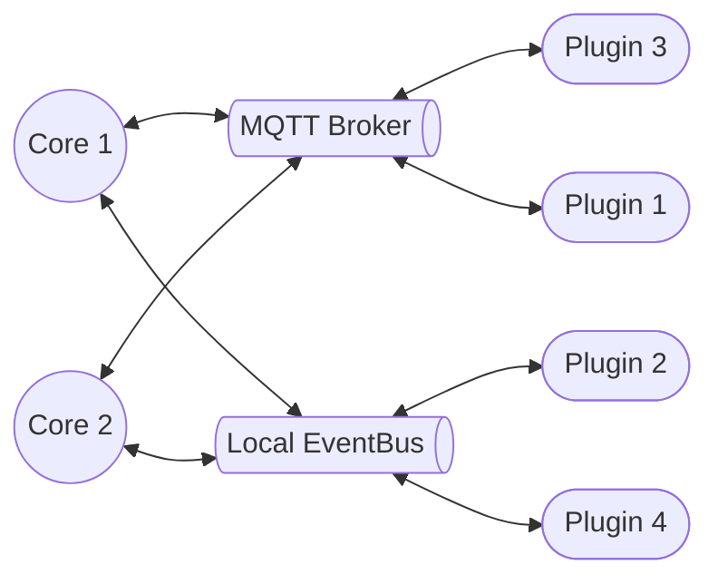


### Orbiter

`Orbiter` is the base class which provides common capabilities to components. 
Therefore, you can use the provided methods both in [Cores](#core) and [Plugins](#plugin).

It manages _[pending requests](#pending-requests), [connections](#connections), [keepalive](#keepalive) and [connection close procedure](#connection-close-procedure)_. In addiction, it has useful _shared methods_ and main _loop_.

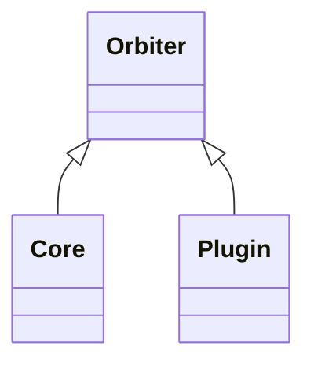

Main public attributes:

- `identifier` is the _unique_ identifier
- `eventbus_client` is a [Busline](https://github.com/orbitalis-framework/py-busline) client, used to send events
- `discover_topic` specifies topic used to send discover messages
- `raise_exceptions` if `True`, exceptions are raised, otherwise they are managed by try/catch
- `loop_interval` specifies how often the loop iterations are called (it is a minimum value, because maximum depends on weight of operations in loop)
- `with_loop` set to `False` if you don't want the loop (care about _what_ [loop](#loop) do)
- `close_connection_if_unused_after` if not None, it specifies how many seconds can pass without use a connection, then it is closed
- `pending_requests_expire_after` if not None, it specifies how many seconds can pass before that a pending request is discarded 
- `consider_others_dead_after` states how many seconds can pass before that a remote orbiter is considered dead if no keepalive arrives
- `send_keepalive_before_timelimit` states how many seconds before a keepalive message is sent that other remote orbiter considers current orbiter dead
- `graceful_close_timeout`: states how many seconds a graceful close connection can be pending

Main hooks:

- `_get_on_close_data`: used to obtain data to send on close connection, by default None is returned
- `_on_starting`: called before starting
- `_internal_start`: actual implementation to start the orbiter
- `_on_started`: called after starting
- `_on_stopping`: called before stopping
- `_internal_stop`: actual implementation to stop the orbiter
- `_on_stopped`: called after stopping
- `_on_promote_pending_request_to_connection`: called before promotion
- `_on_keepalive_request`: called on keepalive request, before response
- `_on_keepalive`: called on inbound keepalive
- `_on_graceless_close_connection`: called before graceless close connection request is sent
- `_on_close_connection`: called when a connection is closed
- `_on_graceful_close_connection`: called before sending graceful close connection request
- `_on_loop_start`: called on loop start
- `_on_new_loop_iteration`: called before every loop iteration
- `_on_loop_iteration_end`: called at the end of every loop iteration
- `_on_loop_iteration`: called during every loop iteration

Main methods:

- `_retrieve_connections`: retrieve all connections which satisfy query
- `discard_expired_pending_requests`: remove expired pending requests and return total amount of discarded requests 
- `close_unused_connections`: send a graceful close request to all remote orbiter if connection was unused based on `close_connection_if_unused_after`
- `force_close_connection_for_out_to_timeout_pending_graceful_close_connection`: send graceless close connection based on `graceful_timeout` if a connection is in close pending due to graceful close connection 
- `update_acquaintances`: update knowledge about keepalive request topics, keepalive topics and dead time
- `have_seen`: update last seen for remote orbiter
- `send_keepalive`
- `send_keepalive_request`
- `send_all_keepalive_based_on_connections`: send keepalive messages to all remote orbiters which have a connection with this orbiter
- `send_keepalive_based_on_connections_and_threshold`: send keepalive messages to all remote orbiters which have a connection with this orbiter only if `send_keepalive_before_timelimit` seconds away from being considered dead this orbiter
- `send_graceless_close_connection`: send a graceless close connection request to specified remote orbiter, therefore, self side connection will be closed immediately
- `send_graceful_close_connection`: send a graceful close connection request to specified remote orbiter, therefore self side connection is not close immediately, but ACK is waited
- `_close_self_side_connection`: close local connection with remote orbiter, therefore only this orbiter will no longer be able to use connection. Generally, a close connection request was sent before this method call.


#### Loop

Every orbiter has an internal **loop** which performs periodically operations. Automatic loop initialization can be avoided setting `with_loop=False`.

Loop is stopped when `stop` method is called, but you can stop it prematurely using `stop_loop` method. 
If you want to pause loop, you can use `pause_loop` and `resume_loop`.

Additionally to hooks, the following operations (already discussed) are executed in parallel:

- `_on_loop_iteration`
- `close_unused_connections`
- `discard_expired_pending_requests`
- `force_close_connection_for_out_to_timeout_pending_graceful_close_connection`
- `send_keepalive_based_on_connections_and_threshold`

Hooks:

- `_on_loop_start`: called on loop start
- `_on_new_loop_iteration`: called before every loop iteration
- `_on_loop_iteration_end`: called at the end of every loop iteration
- `_on_loop_iteration`: called during every loop iteration


### Introduction to Core-Plugin Communication

Orbitalis implemented different communication protocol which are used to ensure that orbiters can share information and connect them together.

If you only use this library, you should not care about their implementation details, because every was made by us. Instead, if you want to know more or if you want to contribute, please read the [Advance Guide](#advance-guide). 

#### Handshake

To allow cores and plugins to create connections a handshake mechanism was implemented based on how DHCP works.


There are 4 steps:

1. **Discover**: message used by cores to notify plugins of their presence and to ask operations connections, core provides a full set of pluggable operations with related information
2. **Offer**: Message used by plugins to response to discover message, providing their base information and a list of offered operations. List of offered operations can be smaller than fullset provided by discover
3. **Reply**
   - **Request**: message used by core to formally request an operation. Every operation has own request. Core provides additional information to finalize the connection
   - **Reject**: message used by core to formally reject an operation (e.g., not needed anymore). Every operation has own reject
4. **Response**
   - **Confirm**: message used by plugins to confirm the connection creation
   - **OperationNoLongerAvailable**: message used by plugins to notify core that operation is no longer available


When an [Pending Request](#pending-requests) is *confirmed*, then a [Connection](#connections) is generated (and the related request is removed).

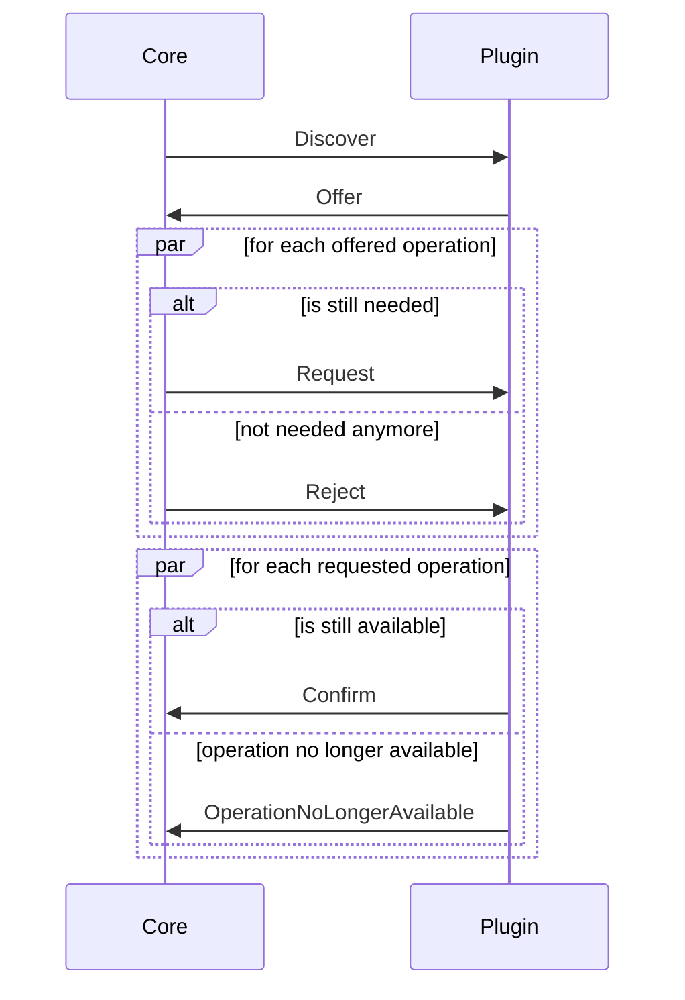

Orbiters which are related to the same context must use the same **discover topic** (by default `$handshake.discover`).
It can be set using `discover_topic` attribute.

Other topics are automatically generated, but generation can be modified overriding `_build_*` methods.

We must notice that discover and offer messages are also used to share information about presence of cores/plugins.
Theoretically, this means that a plugin may send an offer without an explicit discover, 
for example if a connection is closed and a slot for an operation becomes available. Anyway, this is not performed in current implementation.


#### Connections

`Connection` is a link between a core and a plugin **related to a *single* operation**, therefore more connections can be present between same core and plugin.

Regularly, connections are created after a handshake procedure, promoting a [Pending Request](#pending-requests). Generally you don't need to know how to create a connection, but if you want, you can read the [Advance Guide](#advance-guide).

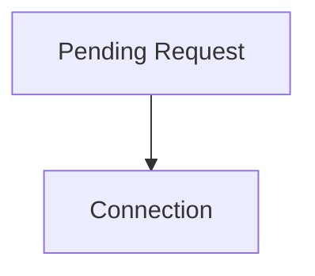

`Connection` class store all information about a connection:

- `operation_name`
- `remote_identifier`
- `incoming_close_connection_topic`: topic on which close connection request arrives from remote orbiter
- `close_connection_to_remote_topic`: topic which orbiter must use to close connection with remote orbiter
- `lock`: `asyncio.Lock`, used to synchronize connection uses
- `input`: acceptable `Input`
- `output`: sendable `Output`
- `input_topic`
- `output_topic`
- `soft_closed_at`: used during graceful close connection
- `created_at`: connection creation datetime
- `last_use`: datetime of last use

`last_use` must be updated **manually**, if you want to update it, using `touch` method on each connection (remember to *lock* the connection).

For example, when a new event arrives:

```python
# Following a custom plugin (MyPlugin) with an operation "my_operation"
@dataclass
class MyPlugin(Plugin):
    @operation(
        # operation name
        name="my_operation",
        
        # operation is fed with Int64Message messages (integer)
        input=Input.from_message(Int64Message),
        
        # operation doesn't send any output
        output=Output.no_output()
    )
    async def its_event_handler(self, topic: str, event: Event[...]):

        # Retrieve connections related to the input topic and the operation name
        connections = self._retrieve_connections(
            input_topic=topic, 
            operation_name="my_operation"
        )
        
        # Touch each operation to update `last_use`
        for connection in connections:
            async with connection.lock:     # lock connection to be async-safe
                connection.touch()
```

Fortunately, there is an useful method called `_retrieve_and_touch_connections` which encapsulates exactly that code:

```python
# Same plugin of previous example, 
# but in which _retrieve_and_touch_connections is used

@dataclass
class MyPlugin(Plugin):
    @operation(
        name="my_operation",
        input=Input.from_message(Int64Message),
        output=Output.no_output()
    )
    async def its_event_handler(self, topic: str, event: Event[...]):
        await self._retrieve_and_touch_connections(
            input_topic=topic, 
            operation_name="my_operation"
        )
```

Orbiter connections are stored in `_connections` attribute.

You can manage them using following methods:

- `_add_connection`
- `_remove_connection` (_does not lock automatically the connection_)
- `_connections_by_remote_identifier`: retrieves connection based on remote identifier
- `_retrieve_connections`: to query connections
- `_find_connection_or_fail`: find _the_ connection based on `operation_name` and `input_topic` 
- `close_unused_connections` based on `close_connection_if_unused_after` and `last_use`


> [!IMPORTANT]
> Remember that potentially you can have more connections associated with the same pair input topic and operation name, based on how you have defined builder methods for input/output topics. This is the reason behind the fact that you don't receive a single connection by default as an input parameter. Anyway, if you are sure that **only one connection** is present, you can use `_find_connection_or_fail` as specified above.

#### Connection Close Procedure

An [orbiter](#orbiter) (Core or Plugin) can close a connection in every moment. There are two ways to close a connection: *Graceless* or *Graceful*.

In the following example we suppose an orbiter `"my_orbiter1"` that closes connection with another orbiter `"my_orbiter2"` related to operation `"my_operation"`.

In **Graceless** procedure the orbiter sends a `GracelessCloneConnectionMessage` to remote one and close connection immediately:

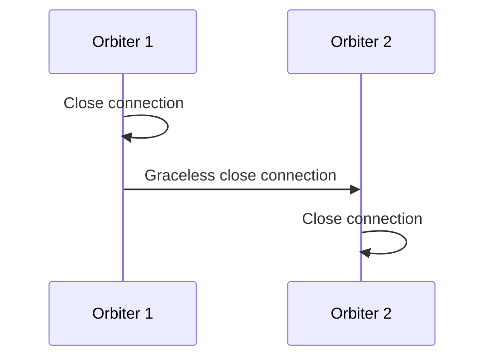

```python
orbiter1.send_graceless_close_connection(
    remote_identifier="my_orbiter2",
    operation_name="my_operation"
)
```

In **Graceful** the orbiter sends a `GracefulCloseConnectionMessage` to remote one. Remote orbiter is able to perform some operations before connection is actually closed. Remote orbiter must send a `CloseConnectionAckMessage`, after that connection is closed. If `graceful_close_timeout` is not `None` is used to send graceless close connection if ACK is not sent. 

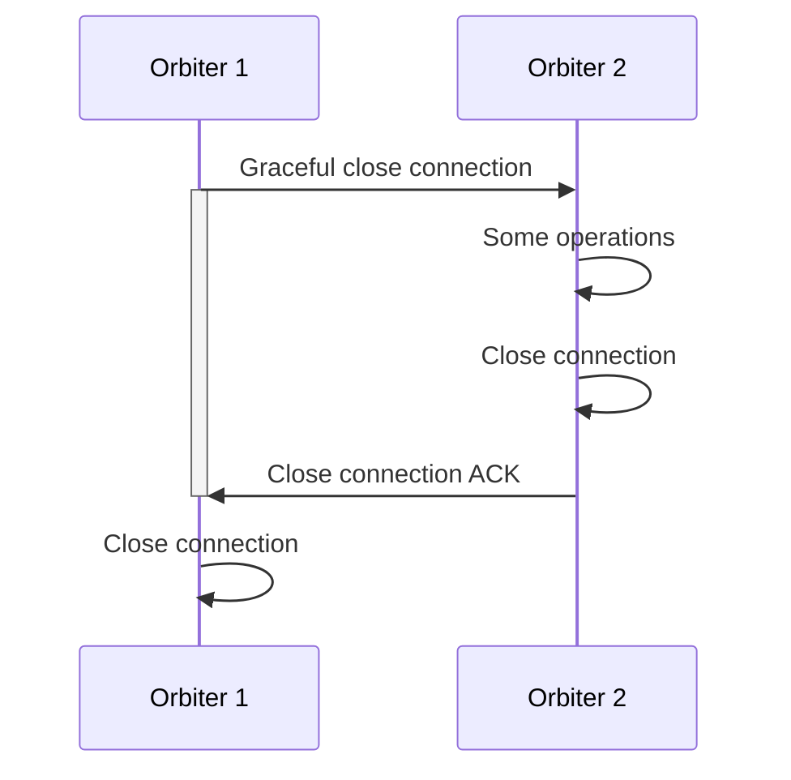

```python
orbiter1.send_graceful_close_connection(
    remote_identifier="my_orbiter2",
    operation_name="my_operation"
)
```

When all connections with a remote orbiter are closed, orbiter unsubscribes itself from topics in `_unsubscribe_on_full_close_bucket` field.

Both during graceful or graceless method call, you can provide data (`bytes`) which will be sent when connection is actually closed.
For example, considering graceful procedure:

```python
orbiter1.send_graceful_close_connection(
    remote_identifier="my_orbiter2",    # identifier of orbiter related to connection to close
    operation_name="my_operation",
    data=bytes(...)     # serialize your data
)
```

Hooks:

- `_on_graceless_close_connection`: called before graceless close connection request is sent
- `_on_close_connection`: called when a connection is closed
- `_on_graceful_close_connection`: called before sending graceful close connection request

> [!NOTE]
> These methods are also called when a connection is closed using method `close_unused_connections` (used to close unused connections based on `close_connection_if_unused_after` and `last_use`).

#### Keepalive

**Keepalive mechanism** allows orbiters to preserve connections during the time. Every orbiter must send a keepalive to all own linked orbiters.

An orbiter can _request_ a keepalive using `send_keepalive_request` method, which sends a `KeepaliveRequestMessage`.

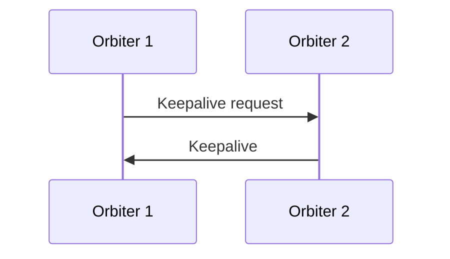

Keepalive are sent using `KeepaliveMessage` messages. You can manually send a keepalive using `send_keepalive` method.

In addiction, `send_all_keepalive_based_on_connections` and `send_keepalive_based_on_connections_and_threshold` are provided.
`send_all_keepalive_based_on_connections` sends a keepalive to all remote orbiters which have an opened connection, 
instead `send_keepalive_based_on_connections_and_threshold` sends a keepalive to all remote orbiters which have an opened connection 
only if it is in range `send_keepalive_before_timelimit` seconds before remote orbiter considers it _dead_.

You can know which are dead remote orbiters thanks to `dead_remote_identifiers` property.

Main related fields:

- `_others_considers_me_dead_after`
- `_remote_keepalive_request_topics`
- `_remote_keepalive_topics`
- `_last_seen`
- `_last_keepalive_sent`

Hooks:

- `_on_keepalive_request`: called on keepalive request, before response
- `_on_keepalive`: called on inbound keepalive


### Plugin

`Plugin` is an [Orbiter](#orbiter) and it is basically an _operations provider_. In a certain sense, plugins lent possibility to execute their operations.

In particular, every plugin has a set of operations which are exposed to other components (i.e., cores).
Only connected [Cores](#core) should execute operations, but this is not strictly ensured, you should check if there is a valid connection during operation elaboration.
You can check this using `_retrieve_connections` or `_find_connection_or_fail`.

A plugin is a state machine which follows this states:

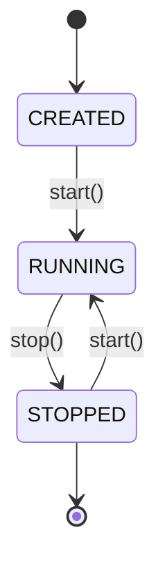

You can easily create a new plugin inheriting `Plugin` abstract class. Remember to use `@dataclass` For example:

```python
@dataclass
class MyPlugin(Plugin):
    ... # your plugin's operations and logic
```


Main hooks:

- `_on_new_discover`: called when a new discover message arrives
- `_on_reject`: called when a reject message arrives
- `_setup_operation`: called to set up operation when connection is created
- `_on_request`: called when a new request message arrives
- `_on_reply`: called when a new reply message arrives

Main methods:

- `send_offer`: send a new offer message in given topic to given core identifier (it should be used only if you want to send an offer message manually)
- `with_operation`: generally used during creation, allows you to specify additional operations (but generally we use decorator)
- `with_custom_policy`: generally used during creation, allows you to specify a custom operation policy


#### Operations

An **operation** (`Operation`) represents a feature of a plugin, which is exposed and can be executed remotely. 
Operations are managed by `OperationsProviderMixin` which also provides builder-like methods.

Every operation has the following attributes:

- `name`: unique name which identify the operation
- `handler`: [Busline](https://github.com/orbitalis-framework/py-busline) handler, which will be used to handle inbound events
- `policy`: specifies default operation lending rules, you can override this using `with_custom_policy` method or modifying `operations` attribute directly
- `input`: specifies which is the acceptable input
- `output`: specifies which is the sendable output

Even if output can be specified, if a `Core` doesn't need it, it should not sent. Obviously, you decide which messages must be sent in which topics, so you must ensure the compliance.

You can **add or modify manually operations** to a plugin thanks to `operations` attribute, otherwise you can use `@operation` **decorator**. 

`@operation` if you don't provide an `input` or an `output`, they are considered "no input/output" (see [input/output](#input--output)). 
If you don't specify `default_policy`, `Policy.no_constraints()` is assigned.

`@operation` automatically add to `operations` attributes the generated `Operation` object, related to (operation) `name` key.

For example, if you want to create a plugin having an operation `"lowercase"` which supports strings as input and produces strings (without lent constraints, i.e. no policy):

```python
@dataclass
class LowercaseTextProcessorPlugin(Plugin):

    @operation(
        name="lowercase",       # operation's name
        input=Input.from_message(StringMessage),    # operation's input
        output=Output.from_message(StringMessage)   # operation's output
        # no policy is specified => Policy.no_constraints()
    )
    async def lowercase_event_handler(self, topic: str, event: Event[StringMessage]):
        # NOTE: input message specified in @operation should be the same of 
        # what is specified as type hint of event parameter

        # Retrieve input string value, remember that it is wrapped into StringMessage
        input_str = event.payload.value

        lowercase_text = input_str.lower()  # process the string

        # Retrieve and touch related connections
        connections = await self._retrieve_and_touch_connections(
            input_topic=topic, 
            operation_name="lowercase"
        )

        tasks = []
        for connection in connections:

            # Only if the connection expects an output
            # it is published in the related topic
            # specified by `connection.output_topic`
            if connection.has_output:
                tasks.append(
                    asyncio.create_task(
                        self.eventbus_client.publish(
                            connection.output_topic,
                            lowercase_text  # will be wrapped into StringMessage
                        )
                    )
                )

        await asyncio.gather(*tasks)    # wait publishes
```

> [!NOTE]
> Method name is not related to operation's name.


##### Policy

`Policy` allows you to specify for an operation:

- `maximum` amount of connections
- `allowlist` of remote orbiters
- `blocklist` of remote orbiters

Obviously, you can specify `allowlist` or `blocklist`, not both.

If you don't want constraints: `Policy.no_constraints()`.

If you use `@operation`, you can specified a *default policy*, which is what is used if you don't override it during plugin initialization.
Anyway, you could manage manually operations' policies, but we advise against.

```python
@dataclass
class LowercaseTextProcessorPlugin(Plugin):

    @operation(
        name="lowercase",
        input=Input.from_message(StringMessage),
        output=Output.from_message(StringMessage),
        default_policy=Policy(
            ... # insert here you constraints (e.g. allowlist or maximum)
        )
    )
    async def lowercase_event_handler(self, topic: str, event: Event[StringMessage]):
        ...     # operation's logic
```

As already mentioned, if you want to override default policy for a plugin's operation you can use `with_custom_policy`.

For example, if you want to add an allowlist (within core identifier `"my_core"`) for the above plugin, related to operation `"lowercase"`:

```python
plugin = LowercaseTextProcessorPlugin(...)
        .with_custom_policy(        # default policy specified with @operation will be override
            operation_name="lowercase",     # target operation
            policy=Policy(allowlist=["my_core"])    # new custom policy
        )
```

##### Input & Output

`Input` and `Output` are both `SchemaSpec`, i.e. the way to specify a schema set.

In a `SchemaSpec` we can specify `support_empty_schema` if we want to support payload-empty events, 
`support_undefined_schema` if we want to accept every schema and/or a schema list (`schemas`). A schema is a string.

We do have an input or an output only if:

```python
support_undefined_schema or support_empty_schema or has_some_explicit_schemas
```

In other words, we must always specify an `Input`/`Output` even if it is "no input/output". 
We can easily generate a "no input/output" thanks to: 

```python
input = Input.no_input()

assert not input.has_input

output = Output.no_output()

assert not output.has_output
```

If we want to generate a filled `Input`/`Output`:

```python
# Input related with MyMessage
Input.from_message(MyMessage)

# Input related with MyMessage, same as above
Input.from_schema(MyMessage.avro_schema())

# Input which accepts empty events
Input.empty()

# Input which accepts any payload
Input.undefined()

# Manual initialization of an Input object
Input(schemas=[...], support_empty_schema=True, support_undefined_schema=False)
```

By default, given that we use Avro JSON schemas, two schemas are compatible if the dictionary version of both is equal or
if the string version of both is equal.

For this reason, you must avoid time-based default value in your classes, because Avro set as default a time-variant value. 
Therefore, in this way, two same-class schema are **different**, even if they are related to the same class.

```python
created_at: datetime = field(default_factory=lambda: datetime.now())    # AVOID !!!
```


#### Plugins inheritance example

In this example, we will show you how to implement a **hierarchy of plugins**.

We will define `LampPlugin` abstract class plugin which provides a common operation `"get_status"`, then it will be inherited by `LampXPlugin` and `LampYPlugin` which add more operations.

```python
class LampStatus(StrEnum):
    """
    Utility enum to define possible lamp statuses
    """

    ON = "on"
    OFF = "off"


@dataclass
class StatusMessage(AvroMessageMixin):
    """
    Custom message defined to share status of lamps
    """

    lamp_identifier: str
    status: str     # "on" or "off"
    created_at: datetime = None # it is an Avro message, avoid default of time-variant fields

    def __post_init__(self):
        if self.created_at is None:
            self.created_at = datetime.now()


@dataclass
class LampPlugin(Plugin, ABC):
    """
    Plugin to control a smart lamp which has an energy-meter
    """

    # Custom plugin attributes
    kw: float  # lamp energy consumption
    status: LampStatus = field(default=LampStatus.OFF)
    on_at: Optional[datetime] = field(default=None) # datetime of on request
    total_kwh: float = field(default=0.0)   # total consumption history

    @property
    def is_on(self) -> bool:
        return self.status == LampStatus.ON

    @property
    def is_off(self) -> bool:
        return self.status == LampStatus.OFF

    def turn_on(self):
        self.status = LampStatus.ON

        if self.on_at is None:
            self.on_at = datetime.now()

    def turn_off(self):
        """
        Turn off this lamp and update consumption history
        """

        self.status = LampStatus.OFF

        if self.on_at is not None:
            # Update total consumption:
            self.total_kwh += self.kw * (datetime.now() - self.on_at).total_seconds() / 3600

            self.on_at = None

    @operation(
        name="get_status",
        input=Input.empty(),
        output=Output.from_message(StatusMessage)
    )
    async def get_status_event_handler(self, topic: str, event: Event):
        connections = await self._retrieve_and_touch_connections(input_topic=topic, operation_name="get_status")

        # Only one connection should be present on inbound topic
        assert len(connections) == 1

        connection = connections[0]

        assert connection.output_topic is not None
        assert connection.output.has_output

        # Manually touch the connection
        async with connection.lock:
            connection.touch()

        # Send output to core
        await self.eventbus_client.publish(
            connection.output_topic,
            StatusMessage(self.identifier, str(self.status))
        )

    @abstractmethod
    async def turn_on_event_handler(self, topic: str, event: Event):
        raise NotImplemented()

    @abstractmethod
    async def turn_off_event_handler(self, topic: str, event: Event):
        raise NotImplemented()
```

```python
@dataclass
class LampXPlugin(LampPlugin):
    """
    Specific plugin related to brand X of smart lamps.
    This type of lamps doesn't have additional features
    """

    @operation(     # add new operation with name: "turn_on"
        name="turn_on",
        input=Input.empty()     # accepts empty events
    )
    async def turn_on_event_handler(self, topic: str, event: Event):
        self.turn_on()

    @operation(     # add new operation with name: "turn_off"
        name="turn_off",
        input=Input.empty()     # accepts empty events
    )
    async def turn_off_event_handler(self, topic: str, event: Event):
        self.turn_off()
```

```python
# Create new lamp X plugin
lamp_x_plugin = LampXPlugin(
    identifier="lamp_x_plugin",
    eventbus_client=...,    # provide Busline client
    raise_exceptions=True,
    with_loop=False,

    kw=24      # LampPlugin-specific attribute
).with_custom_policy(   # override custom policy related to operation "turn_on"
    operation_name="turn_on",
    policy=Policy(allowlist=["smart_home"])
)
```

```python
@dataclass(frozen=True)
class TurnOnLampYMessage(AvroMessageMixin):
    """
    Custom message to turn on lamp of brand Y.
    You can provide a "power" value which will be used to
    control brightness (and energy consumption)
    """

    power: float = field(default=1)

    def __post_init__(self):
        assert 0 < self.power <= 1

@dataclass(frozen=True)
class TurnOffLampYMessage(AvroMessageMixin):
    """
    Custom message to turn off lamp of brand Y.
    You can reset energy-meter setting True the flag
    """
    reset_consumption: bool = field(default=False)


@dataclass(kw_only=True)
class LampYPlugin(LampPlugin):
    """
    Specific plugin related to brand Y of smart lamps.
    These lamps are able to manage brightness level
    thanks to "power" attribute
    """

    power: float = field(default=1)

    @override
    def turn_off(self):
        """
        Overridden version to turn off the lamp and compute energy consumption 
        also based on power field
        """

        self.status = LampStatus.OFF

        if self.on_at is not None:
            self.total_kwh += self.power * self.kw * (datetime.now() - self.on_at).total_seconds() / 3600

            self.on_at = None

    @operation(     # add new operation with name: "turn_on"
        name="turn_on",
        input=Input.from_message(TurnOnLampYMessage)   # accepts TurnOnLampYMessage messages (checking its Avro schema)
    )
    async def turn_on_event_handler(self, topic: str, event: Event[TurnOnLampYMessage]):
        self.turn_on()
        self.power = event.payload.power

    @operation(     # add new operation with name: "turn_off"
        name="turn_off",
        input=Input.from_schema(TurnOffLampYMessage.avro_schema())   # accepts TurnOffLampYMessage messages
    )
    async def turn_off_event_handler(self, topic: str, event: Event[TurnOffLampYMessage]):
        self.turn_off()

        if event.payload.reset_consumption:
            self.total_kwh = 0
```

```python
# Create a new lamp Y plugin
lamp_y_plugin = LampYPlugin(
    identifier="lamp_y_plugin",
    eventbus_client=...,    # provide a Busline client
    raise_exceptions=True,
    with_loop=False,

    kw=42
)
```


### Core

`Core` is an [Orbiter](#orbiter) and it is the component which connects itself to [plugins](#plugin), in order to be able to **execute their operations**.

We must notice that Orbitalis' Cores are able to manage operations having different inputs/outputs (but same name), thanks to (Avro) schemas.

We can use a core to execute operations and collect outputs (if they are present).

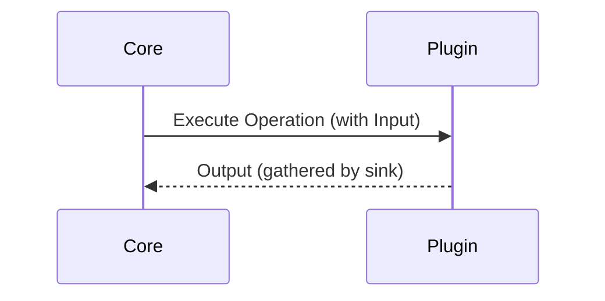

A core can also receive messages without an explicit `execute` call, e.g. a plugin can send information periodically, such as a report.

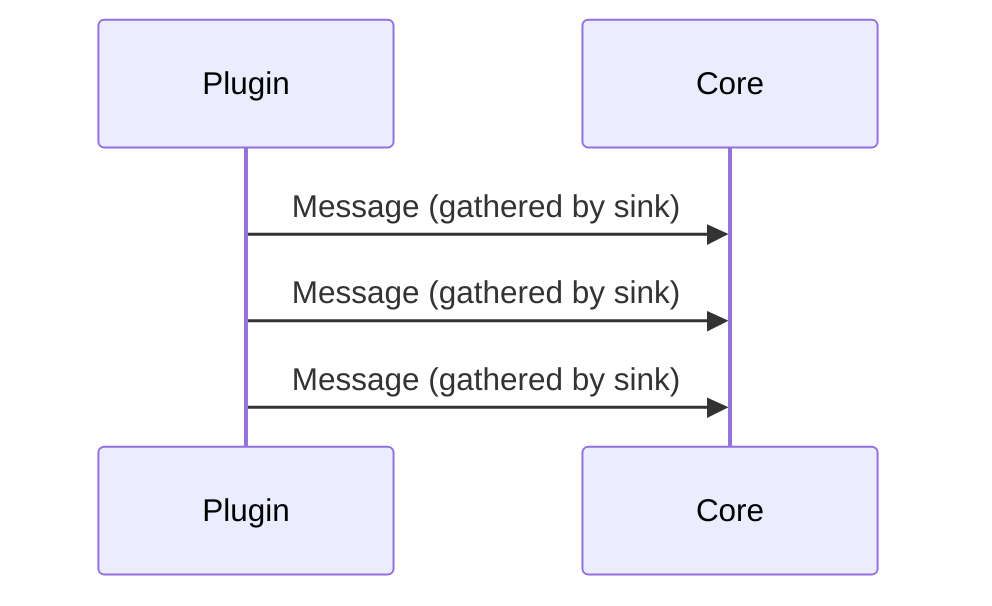

We can specify needed operations which make a core compliant with respect to our needs. In fact, `Core` follows these states changes:

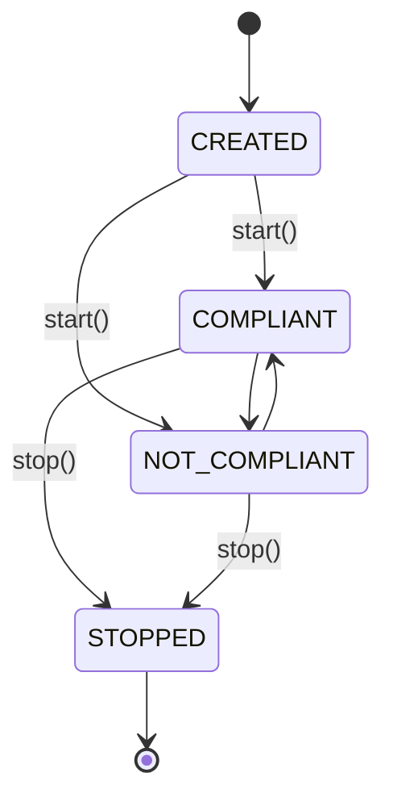

`COMPLIANT` when all needs are satisfied, otherwise `NOT_COMPLIANT`.

Main public attributes:

- `discovering_interval`: interval between two discover messages (only when loop is enabled)
- `operation_requirements`: specifies which operations are needed to be compliant, specifying their constraints and optionally the default setup data or the sink
- `operation_sinks` (see [sinks](#sinks))

Main hooks:

- `_on_compliant`: called when core becomes compliant
- `_on_not_compliant`: called when core becomes not compliant
- `_on_send_discover`: called before discover message is sent
- `_get_setup_data`: called to obtain setup data which generally will be sent to plugins. By default, `default_setup_data` is used
- `_on_new_offer`: called when a new offer arrives
- `_on_confirm_connection`: called when a confirm connection arrives
- `_on_operation_no_longer_available`: called when operation no longer available message arrives
- `_on_response`: called when response message arrives

Main methods:

- `current_constraint_for_operation`: returns current constraint for operation based on current connections
- `is_compliant_for_operation`: evaluate at run-time if core is compliant for given operation based on its configuration. It may be a time-consuming operation
- `is_compliance`: evaluate at run-time if core is global compliant based on its configuration. It may be a very time-consuming operation
- `update_compliant`: use `is_compliant` to update core's state
- `_operation_to_discover`: returns a dictionary `operation_name` => `not_satisfied_need`, based on current connections. This operations should be discover
- `execute`: execute the operation by its name, sending provided data. You must specify which plugin must be used, otherwise `ValueError` is raised.
- `sudo_execute`: bypass all checks and send data to topic

```python
# Create a custom core

@dataclass
class MyCore(Core):
    ...     # core's sinks and logic
```

#### Required operations


`operation_requirements` attribute is a dictionary where keys are operation names and values are `OperationRequirement` objects.

We can specify:

- `constraint`: set of rules to manage connection requests
- `override_sink`: to specify a different sink with respect to default provided by core 
- `default_setup_data`: bytes which are send by default to plugin on connection establishment

`Constraint` class allows you to be very granular in rule specifications:

- `mandatory`: list of needed plugin identifiers
- `minimum` number of additional plugins (plugins in mandatory list are excluded)
- `maximum` number of additional plugins (plugins in mandatory list are excluded)
- `allowlist`/`blocklist`
- `inputs`: represents the list of supported `Input` 
- `outputs`: represents the list of supported `Output` 

In other words, you can specify a list of possible and different inputs and outputs which are supported by your core.

You must observe that inputs and outputs are not related, therefore all possible combinations are evaluated.

For example, if your core needs these operations:

- `operation1`: `"plugin1"` is mandatory, at least 2 additional plugins, maximum 5 additional plugins. Borrowable `operation1` can be fed with "no input", `Operation1InputV1Message` or `Operation1InputV2Message`, instead they produce nothing as output
- `operation2`: `"plugin1"` and `"plugin2"` are allowed (pluggable), there is no a minimum or a maximum number of additional plugins. Borrowable `operation2` must be feedable with empty events (no message) and they must produce `Opeartion2OutputMessage` messages
- `operation3`: no mandatory plugins required, no additional plugins required (any number of connections), but `"plugin2"` can not be plugged (due to `blocklist`). `operation3` has no input (therefore core doesn't interact with plugin, but is plugin to send data arbitrary). `Operation3Output` is expected to be sent to core

```python
YourCore(
    ...,    # other attributes such as eventbus_client, identifier, ... (see next example)
    operation_requirements={

        # required operation name: "operation1"
        "operation1": OperationRequirement(Constraint(
            minimum=2,      # minimum number of non-mandatory plugins
            maximum=5,      # maximum number of non-mandatory plugins
            mandatory=["plugin1"],  # list of mandatory plugins
            inputs=[Input.no_input(), Input.from_message(Operation1InputV1Message), Input.from_message(Operation1InputV2Message)],  # list of supported inputs for this operation
            outputs=[Output.no_output()]    # list of supported outputs for this operation
        )),

        # required operation name: "operation2"
        "operation2": OperationRequirement(Constraint(
            minimum=0,
            allowlist=["plugin1", "plugin2"],   # list of allowed plugins
            inputs=[Input.empty()],
            outputs=[Output.from_message(Opeartion2OutputMessage)]
        )),

        # required operation name: "operation3"
        "operation3": OperationRequirement(Constraint(
            blocklist=["plugin2"]       # list of blocked plugins
            inputs=[Input.no_input()],
            outputs=[Output.from_message(Operation3Output)]
        )),
    }
)
```

#### Sink

In order to be able to handle operation outputs, cores must be equipped with `Sink`, which are basically Busline's `EventHandler` _associated to an operation_.

Operation's sinks are stored in `operation_sinks`. You can manage them in four ways:

- Manually add them directly using the attribute `operation_sinks`

```python
@dataclass
class MyCore(Core):

    # Add in post init a new sink (for operation's name "my_operation")
    def __post_init__(self):
        super().__post_init__()     # mandatory! Otherwise Core logic will not be executed

        # Add a new sink for operation "my_operation", it is a simple in-place lambda
        self.operation_sinks["my_operation"] = CallbackEventHandler(lambda t, e: print(t))
```

- Overriding the pre-defined sink using `override_sink` field in `OperationRequirement` during core instantiation. You must provide a Busline `EventHandler`

```python
core = MyCore(
        eventbus_client=...,    # build a Busline's client
        # ...other attributes
        operation_requirements={
            "lowercase": OperationRequirement(Constraint(
                inputs=[Input.from_message(StringMessage)],
                outputs=[Output.from_message(StringMessage)],

            #  provide a new sink: 
            ), override_sink=CallbackEventHandler(lambda t, e: print(t)))   
            # in-place lambda will be used to handle new events
        }
    )
```

- Using `with_operation_sink` method during core instantiation to add more sinks in core instance (this has the same effect of direct management in `__post_init__`)

```python
core = MyCore(...)      # fill with core attributes
        .with_operation_sink(
            operation_name="my_operation",  # sink's related operation name
            handler=CallbackEventHandler(lambda t, e: print(t))     # event handler for operation's outputs
        )
```

- `@sink` decorator, which you can use to decorator your methods and functions providing *operation name*

```python
@dataclass
class MyCore(Core):     # Inherit Core class to create your custom core

    @sink("plugin_operation_name")  # new sink with related operation name
    async def my_operation_event_handler(self, topic: str, event: Event[MyMessage]):
        ...     # sink logic
```

Sinks in `operation_sinks` are used to link sink automatically with related operation during handshake. Sink related to an operation in `operation_sinks` is ignored if `override_sink` in `OperationRequirement` for that operation is set.


#### Example

You should consider plugins of [this example](#plugins-inheritance-example).

```python
@dataclass
class SmartHomeCore(Core):
    # Dictionary to store lamps statues
    lamp_status: Dict[str, str] = field(default_factory=dict)

    @sink(  # declared sink related to operation "get_status" 
        operation_name="get_status"
    )
    async def get_status_sink(self, topic: str, event: Event[StatusMessage]):
        self.lamp_status[event.payload.lamp_identifier] = event.payload.status  # store lamp status
```

```python
smart_home = SmartHomeCore(
   identifier="smart_home",     # core's identifier
   eventbus_client=...,     # Busline's client
   operation_requirements={

        # required operation name: "turn_on"
        "turn_on": OperationRequirement(Constraint(
            minimum=1,  # required amount of generic plugins
            mandatory=[self.lamp_x_plugin.identifier],  # mandatory plugin (identifier)
            inputs=[Input.empty()],     # list of supported inputs (in this case empty events)
            outputs=[Output.no_output()]    # list of supported outputs (in this case no outputs are expected)
        )),

        # required operation name: "turn_off"
        "turn_off": OperationRequirement(Constraint(
            minimum=1,
            allowlist=[self.lamp_x_plugin.identifier],  # list of pluggable plugins
            inputs=[Input.empty()],
            outputs=[Output.no_output()]
        )),
    }
)
```

> [!TIP]
> Check [Busline documentation](https://github.com/orbitalis-framework/py-busline) to know how to create an eventbus client.


#### Execute an operation

The main capability of a [Core](#core) is **execute plugins operations**. As already mentioned, there are two methods to execute operations:

- `execute`
- `sudo_execute`

##### Execute

`execute` is the regular method to execute an operation which uses connections to choose right plugins.

To execute an operation you must provide:

- `operation_name`
- `data` (*optional*, input of operation)
- *Modality*: one among the following parameters: `all`, `any` or `plugin_identifier` 

In fact, `execute` retrieves current connections related to provided `operation_name`, *evaluating compatibility with data input type*.

> [!WARNING]
> If modality is not provided, `ValueError` is raised.

Then, given the set of all potentially connections, core sends data to topics chosen based on modality:

- `all` sends data to all plugins related to retrieved connections
- `any` sends data to a random plugin related to retrieved connections
- `plugin_identifier` sends data to specified plugin

For example, suppose you want to execute `"plugin_operation"` of plugin `"plugin_identifier"`, sending an empty event (i.e., no data):

```python
await self.my_core.execute("plugin_operation", plugin_identifier="plugin_identifier")
#                           ^^^^^^^^^^^^^^^^ operation's name
```


##### Sudo execute

`sudo_execute` allows to bypass connections, send an execution request to a plugin.

```python
my_core.sudo_execute(
    topic="operation_topic",    # topic on which message will be published
    data=YourMessageData(...)   # message data which will be sent
)
```

> [!IMPORTANT]
> We provide `sudo_execute` method because Orbitalis framework works in secure and managed environment, therefore we think a developer can execute arbitrary operations, even if we advice against to use `sudo_execute`. 


## Advance Guide

In this section we have inserted more details about library implementation which you can use to modify regular behavior.

We suppose that [User Guide](#user-guide) was read before this, because in this section we only add more details. 


### Orbiter

TODO

#### Loop

Loop is managed in `__loop` (private) method. The method is private because the entire logic is fully managed and hooks are provided.

Basically, loop is controlled by two `asyncio.Event`:

- `__stop_loop_controller`: used in `while` condition, if it is set, loop is stopped
- `__pause_loop_controller`: if it is set, loop iteration are skipped

As already mentioned in [User Guide](#user-guide), `set` and `clear` method of `asyncio.Event` are wrapped in `stop_loop`, `pause_loop`, `resume_loop` methods.


#### Custom loop

TODO: how to create a custom loop


### Communication protocols more in deep

TODO

#### Handshake

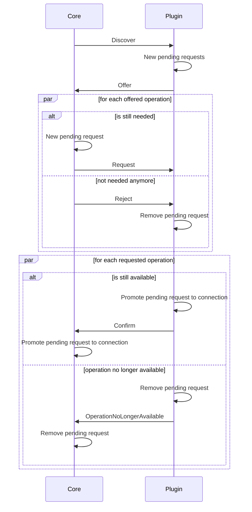

TODO


##### Pending Requests

`PendingRequest` contains information about its future [connection](#connections). It is built during [handshake](#handshake) process, so generally you should not use this class.
Anyway, it has `into_connection` method to build a `Connection` and, similarly to connections, has a `lock` attribute to synchronize elaborations.
`created_at` is the field used to check if a pending request must be discarded.

You can manage pending requests thanks to:

- `_pending_requests_by_remote_identifier`: retrieves pending requests based on remote identifier
- `_add_pending_request` 
- `_remove_pending_request` (_does not lock automatically the pending request_)
- `_is_pending` to know if there is a pending request related to a remote identifier and an operation name
- `_promote_pending_request_to_connection`: (_does not lock automatically the pending request_) transforms a pending request into a connection
- `discard_expired_pending_requests` based on `pending_requests_expire_after` and `created_at`


### Plugin


### Core


#### Manual requirements management


## Future Work

We have planned to allow Plugins to send an offer in a second moment, as explained in [handshake](#handshake) section. To do this, we are going to modify Discover message to allow Cores to decide if this new feature must be considered thanks to a boolean flag. 


## Contribute

In order to coordinate the work, please open an issue or a pull request.

**Thank you** for your contributions!


## Quick start

```python
@dataclass
class LowercaseTextProcessorPlugin(Plugin):
    @operation(
        name="lowercase",
        input=Input.from_message(StringMessage),
        output=Output.from_message(StringMessage)
    )
    async def lowercase_event_handler(self, topic: str, event: Event[StringMessage]):
        lowercase_text = event.payload.value.lower()

        connections = self._retrieve_connections(input_topic=topic, operation_name="lowercase")

        tasks = []
        for connection in connections:
            if connection.has_output:
                tasks.append(
                    asyncio.create_task(
                        self.eventbus_client.publish(
                            connection.output_topic,
                            lowercase_text
                        )
                    )
                )

        await asyncio.gather(*tasks)
```

```python
@dataclass
class MyCore(Core):
    last_result: Optional[str] = None

    @sink("lowercase")
    async def lowercase_sink(self, topic: str, event: Event[StringMessage]):
        self.last_result = event.payload.value
```

```python
plugin = LowercaseTextProcessorPlugin(
    eventbus_client=PubSubClientBuilder().with_subscriber(LocalSubscriber(eventbus=LocalEventBus())).with_publisher(LocalPublisher(eventbus=LocalEventBus())).build(),
)

core = MyCore(
    eventbus_client=PubSubClientBuilder().with_subscriber(LocalSubscriber(eventbus=LocalEventBus())).with_publisher(LocalPublisher(eventbus=LocalEventBus())).build(),
    needed_operations={
        "lowercase": Need(Constraint(
            inputs=[Input.from_message(StringMessage)],
            outputs=[Output.from_message(StringMessage)],
        ))
    }
)

await plugin.start()
await core.start()

await asyncio.sleep(2)

await core.execute(
    operation_name="lowercase",
    data=StringMessage("HELLO"),
    any=True
)

await asyncio.sleep(1)

assert core.last_result == "hello"

await plugin.stop()
await core.stop()
```

## Documentation

Every communication is asynchronous and uses [Busline](https://github.com/orbitalis-framework/py-busline) to send events.

Every time-based values are expressed in seconds, because `asyncio.sleep` is used.

### Overview

Orbitalis allows you to start cores and plugins, connect them together and execute plugin operations.
Cores and plugins can be started in any time and connections are created based on pre-defined policies.

Messages used by Orbitalis are **Avro messages** because we need input and output schemas.

### Orbiter

`Orbiter` is the base class which provides common capabilities to components.

It manages _pending requests, connections, keepalive and connection close procedure_. In addiction, it has useful _shared methods_ and main _loop_.

Main public attributes:

- `identifier` is the _unique_ identifier
- `eventbus_client` is a [Busline](https://github.com/orbitalis-framework/py-busline) client, used to send events
- `discover_topic` specifies topic used to send discover messages
- `raise_exceptions` if `True`, exceptions are raised, otherwise they are managed by try/catch
- `loop_interval` specifies how often the loop iterations are called (it is a minimum value, because maximum depends on weight of operations in loop)
- `with_loop` set to `False` if you don't want the loop (care about _what_ [loop](#loop) do)
- `close_connection_if_unused_after` if not None, it specifies how many seconds can pass without use a connection, then it is closed
- `pending_requests_expire_after` if not None, it specifies how many seconds can pass before that a pending request is discarded 
- `consider_others_dead_after` states how many seconds can pass before that a remote orbiter is considered dead if no keepalive arrives
- `send_keepalive_before_timelimit` states how many seconds before a keepalive message is sent that other remote orbiter considers current orbiter dead
- `graceful_close_timeout`: states how many seconds a graceful close connection can be pending

Main hooks:

- `_get_on_close_data`: used to obtain data to send on close connection, by default None is returned
- `_on_starting`: called before starting
- `_internal_start`: actual implementation to start the orbiter
- `_on_started`: called after starting
- `_on_stopping`: called before stopping
- `_internal_stop`: actual implementation to stop the orbiter
- `_on_stopped`: called after stopping
- `_on_promote_pending_request_to_connection`: called before promotion
- `_on_keepalive_request`: called on keepalive request, before response
- `_on_keepalive`: called on inbound keepalive
- `_on_graceless_close_connection`: called before graceless close connection request is sent
- `_on_close_connection`: called when a connection is closed
- `_on_graceful_close_connection`: called before sending graceful close connection request
- `_on_loop_start`: called on loop start
- `_on_new_loop_iteration`: called before every loop iteration
- `_on_loop_iteration_end`: called at the end of every loop iteration
- `_on_loop_iteration`: called during every loop iteration

Main methods:

- `_retrieve_connections`: retrieve all connections which satisfy query
- `discard_expired_pending_requests`: remove expired pending requests and return total amount of discarded requests 
- `close_unused_connections`: send a graceful close request to all remote orbiter if connection was unused based on `close_connection_if_unused_after`
- `force_close_connection_for_out_to_timeout_pending_graceful_close_connection`: send graceless close connection based on `graceful_timeout` if a connection is in close pending due to graceful close connection 
- `update_acquaintances`: update knowledge about keepalive request topics, keepalive topics and dead time
- `have_seen`: update last seen for remote orbiter
- `send_keepalive`
- `send_keepalive_request`
- `send_all_keepalive_based_on_connections`: send keepalive messages to all remote orbiters which have a connection with this orbiter
- `send_keepalive_based_on_connections_and_threshold`: send keepalive messages to all remote orbiters which have a connection with this orbiter only if `send_keepalive_before_timelimit` seconds away from being considered dead this orbiter
- `send_graceless_close_connection`: send a graceless close connection request to specified remote orbiter, therefore, self side connection will be closed immediately
- `send_graceful_close_connection`: send a graceful close connection request to specified remote orbiter, therefore self side connection is not close immediately, but ACK is waited
- `_close_self_side_connection`: close local connection with remote orbiter, therefore only this orbiter will no longer be able to use connection. Generally, a close connection request was sent before this method call.
- `_loop`: contains loop logic (it should not be overridden)


### Plugin

`Plugin` is an `Orbiter` and it is basically an _operations provider_. In a certain sense, plugins lent possibility to execute their operations.

In particular, every plugin has a set of operations which are exposed to other components (i.e., cores).
Only connected components should execute operations (but this is not strictly ensured, you should check if there is a valid connection during operation elaboration).

A plugin is a state machine which follows this states:


Main hooks:

- `_on_new_discover`: called when a new discover message arrives
- `_on_reject`: called when a reject message arrives
- `_setup_operation`: called to set up operation when connection is created
- `_on_request`: called when a new request message arrives
- `_on_reply`: called when a new reply message arrives

Main methods:

- `send_offer`: send a new offer message in given topic to given core identifier (it should be used only if you want to send an offer message manually)
- `with_operation`: generally used during creation, allows you to specify additional operations (but generally we use decorator)
- `with_custom_policy`: generally used during creation, allows you to specify a custom operation policy

#### Operations

An operation (`Operation`) represents a feature of a plugin, which is exposed and can be executed remotely. 
Operations are managed by `OperationsProviderMixin` which also provides builder-like methods.

Every operation has the following attributes:

- `name`: unique name which identify the operation
- `handler`: [Busline](https://github.com/orbitalis-framework/py-busline) handler, which will be used to handle inbound events
- `policy`: specifies default operation lending rules, you can override this using `with_custom_policy` method or modifying `operations` attribute directly
- `input`: specifies which is the acceptable input
- `output`: specifies which is the sendable output

Even if output can be specified, if a `Core` doesn't need it, it is not sent.

You can add manually operations to a plugin thanks to `operations` attribute, otherwise you can use `@operation` **decorator**. 

`@operation` if you don't provide an `input` or an `output`, they are considered "no input/output" (see [input/output](#input--output)). 
If you don't specify `default_policy`, `Policy.no_constraints()` is assigned.

For example, if you want to create a plugin having an operation `"lowercase"` which supports strings as input and produces strings (without lent constraints):

```python
@dataclass
class LowercaseTextProcessorPlugin(Plugin):
    @operation(
        name="lowercase",
        input=Input.from_message(StringMessage),
        output=Output.from_message(StringMessage)
    )
    async def lowercase_event_handler(self, topic: str, event: Event[StringMessage]):
        ...
```

> [!NOTE]
> Method name is not related to operation's name.

`@operation` automatically add to `operations` attributes the generated `Operation` object, related to (operation) `name` key.

##### Policy

`Policy` allows you to specify for an operation:

- `maximum` amount of connections
- `allowlist` of remote orbiters
- `blocklist` of remote orbiters

Obviously, you can specify `allowlist` or `blocklist`, not both.

If you don't want constraints: `Policy.no_constraints()`.

##### Input & Output

`Input` and `Output` are both `SchemaSpec`, i.e. the way to specify a schema set.

In a `SchemaSpec` we can specify `support_empty_schema` if we want to support payload-empty events, 
`support_undefined_schema` if we want to accept every schema and/or a schema list (`schemas`). A schema is a string.

We do have an input or an output only if:

```python
support_undefined_schema or support_empty_schema or has_some_explicit_schemas
```

In other words, we must always specify an `Input`/`Output` even if it is "no input/output". 
We can easily generate a "no input/output" thanks to: 

```python
input = Input.no_input()

assert not input.has_input

output = Output.no_output()

assert not output.has_output
```

If we want to generate a filled `Input`/`Output`:

```python
Input.from_message(MyMessage)

Input.from_schema(MyMessage.avro_schema())

Input.empty()

Input.undefined()

Input(schemas=[...], support_empty_schema=True, support_undefined_schema=False)
```

By default, given that we use Avro JSON schemas, two schemas are compatible if the dictionary version of both is equal or
if the string version of both is equal.

For this reason, you must avoid time-based default value in your classes, because Avro set as default a time-variant value. 
Therefore, in this way, two same-class schema are **different**, even if they are related to the same class.

```python
created_at: datetime = field(default_factory=lambda: datetime.now())    # AVOID !!!
```

#### Plugins inheritance example

```python
@dataclass
class StatusMessage(AvroMessageMixin):
    plugin_identifier: str
    status: str
    created_at: datetime = None

    def __post_init__(self):
        if self.created_at is None:
            self.created_at = datetime.now()


class LampStatus(StrEnum):
    ON = "on"
    OFF = "off"


@dataclass
class LampPlugin(Plugin, ABC):
    kwh: float
    status: LampStatus = field(default=LampStatus.OFF)
    on_at: Optional[datetime] = field(default=None)
    total_kwh: float = field(default=0.0)

    @property
    def is_on(self) -> bool:
        return self.status == LampStatus.ON

    @property
    def is_off(self) -> bool:
        return self.status == LampStatus.OFF

    def turn_on(self):
        self.status = LampStatus.ON

        if self.on_at is None:
            self.on_at = datetime.now()

    def turn_off(self):
        self.status = LampStatus.OFF

        if self.on_at is not None:
            self.total_kwh += self.kwh * (datetime.now() - self.on_at).total_seconds() / 3600

            self.on_at = None

    @operation(
        name="get_status",
        input=Input.empty(),
        output=Output.from_message(StatusMessage)
    )
    async def get_status_event_handler(self, topic: str, event: Event):
        connections = self._retrieve_connections(input_topic=topic, operation_name="get_status")

        assert len(connections) == 1

        connection = connections[0]

        assert connection.output_topic is not None
        assert connection.output.has_output

        await self.eventbus_client.publish(
            connection.output_topic,
            StatusMessage(self.identifier, str(self.status))
        )

        connection.touch()


    @abstractmethod
    async def turn_on_event_handler(self, topic: str, event: Event):
        raise NotImplemented()

    @abstractmethod
    async def turn_off_event_handler(self, topic: str, event: Event):
        raise NotImplemented()
```

```python
@dataclass
class LampXPlugin(LampPlugin):

    @operation(
        name="turn_on",
        input=Input.empty()
    )
    async def turn_on_event_handler(self, topic: str, event: Event):
        self.turn_on()

    @operation(
        name="turn_off",
        input=Input.empty()
    )
    async def turn_off_event_handler(self, topic: str, event: Event):
        self.turn_off()
```

```python
LampXPlugin(
    identifier="lamp_x_plugin",
    eventbus_client=...,
    raise_exceptions=True,
    with_loop=False,
    kwh=24      # LampPlugin-specific attribute
).with_custom_policy(
    operation_name="turn_on",
    policy=Policy(allowlist=["smart_home"])
)
```

```python
@dataclass(frozen=True)
class TurnOnLampYMessage(AvroMessageMixin):
    power: float = field(default=1)

    def __post_init__(self):
        assert 0 < self.power <= 1

@dataclass(frozen=True)
class TurnOffLampYMessage(AvroMessageMixin):
    reset_consumption: bool = field(default=False)


@dataclass(kw_only=True)
class LampYPlugin(LampPlugin):
    power: float = field(default=1)

    @override
    def turn_off(self):
        self.status = LampStatus.OFF

        if self.on_at is not None:
            self.total_kwh += self.power * self.kwh * (datetime.now() - self.on_at).total_seconds() / 3600
            self.on_at = None

    @operation(
        name="turn_on",
        input=Input.from_schema(TurnOnLampYMessage.avro_schema())
    )
    async def turn_on_event_handler(self, topic: str, event: Event[TurnOnLampYMessage]):
        self.turn_on()
        self.power = event.payload.power

    @operation(
        name="turn_off",
        input=Input.from_schema(TurnOffLampYMessage.avro_schema())
    )
    async def turn_off_event_handler(self, topic: str, event: Event[TurnOffLampYMessage]):
        self.turn_off()

        if event.payload.reset_consumption:
            self.total_kwh = 0
```

```python
LampYPlugin(
    identifier="lamp_y_plugin",
    eventbus_client=...,
    raise_exceptions=True,
    with_loop=False,

    kwh=42
)
```


### Core

`Core` is an `Orbiter` and it is the component which connects itself to [plugins](#plugin), in order to be able to execute their operations.

We must notice that Orbitalis' cores are able to manage operations having different inputs/outputs (but same name), thanks to (Avro) schemas.

We can use a core to execute operations and collect outputs (if they are present).

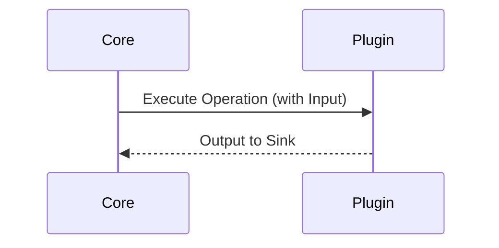

A core can also receive messages without an explicit `execute` call.

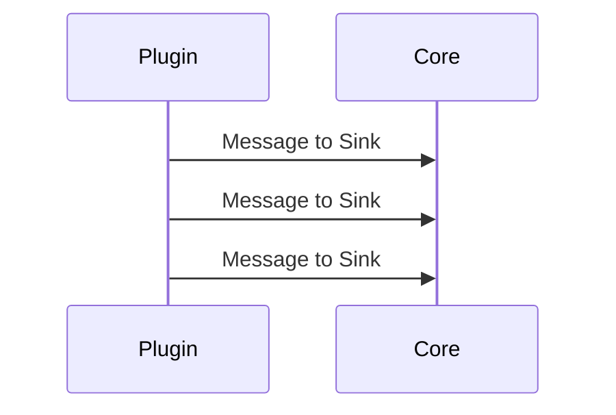

We can specify needed operations which make a core compliant with respect to our needs. In fact, `Core` follows these states changes:


`COMPLIANT` when all needs are satisfied, otherwise `NOT_COMPLIANT`.

Main public attributes:

- `discovering_interval`: interval between two discover messages (only when loop is enabled)
- `needed_operations`: specifies which operations are needed to be compliant with needs, their constraints and optionally the default setup data
- `operation_sinks` (see [sinks](#sinks))

Main hooks:

- `_on_compliant`: called when core becomes compliant
- `_on_not_compliant`: called when core becomes not compliant
- `_on_send_discover`: called before discover message is sent
- `_get_setup_data`: called to obtain setup data which generally will be sent to plugins. By default, `default_setup_data` is used
- `_on_new_offer`: called when a new offer arrives
- `_on_confirm_connection`: called when a confirm connection arrives
- `_on_operation_no_longer_available`: called when operation no longer available message arrives
- `_on_response`: called when response message arrives

Main methods:

- `current_constraint_for_operation`: returns current constraint for operation based on current connections
- `is_compliant_for_operation`: evaluate at run-time if core is compliant for given operation based on its configuration. It may be a time-consuming operation
- `is_compliance`: evaluate at run-time if core is global compliant based on its configuration. It may be a very time-consuming operation
- `update_compliant`: use `is_compliant` to update core's state
- `_operation_to_discover`: returns a dictionary `operation_name` => `not_satisfied_need`, based on current connections. This operations should be discover
- `send_discover_for_operations`
- `send_discover_based_on_needs`
- `execute`: execute the operation by its name, sending provided data. You must specify which plugin must be used, otherwise `ValueError` is raised.
- `sudo_execute`: bypass all checks and send data to topic

#### Needs

`needed_operations` attribute is a dictionary where keys are operation names and values are `Need` objects.

We can specify:

- `constraint`: set of rules to manage connection requests
- `override_sink`: to specify a different sink with respect to default provided by core 
- `default_setup_data`: bytes which are send by default to plugin on connection establishment

`Constraint` class allows you to be very granular in rule specifications:

- `mandatory`: list of needed plugin identifiers
- `minimum` number of additional plugins (plugins in mandatory list are excluded)
- `maximum` number of additional plugins (plugins in mandatory list are excluded)
- `allowlist`/`blocklist`
- `inputs`: represents the list of supported `Input` 
- `outputs`: represents the list of supported `Output` 

In other words, you can specify a list of possible and different inputs and outputs which are supported by your core.

You must observe that inputs and outputs are not related, therefore all possible combinations are evaluated.

For example, if your core needs these operations:

- `operation1`: `"plugin1"` is mandatory, at least 2 additional plugins, maximum 5 additional plugins. Borrowable `operation1` can be fed with "no input", `Operation1InputV1Message` or `Operation1InputV2Message`, instead they produce nothing as output
- `operation2`: `"plugin1"` and `"plugin2"` are mandatory, there is no a minimum or a maximum number of additional plugins. Borrowable `operation2` must be feedable with empty events (no message) and they must produce `Opeartion2OutputMessage` messages
- `operation3`: no mandatory plugins required, no additional plugins required (any number of connections). `operation3` has no input (therefore core doesn't interact with plugin, but is plugin to send data arbitrary). `Operation3Output` is expected to be sent to core

```python
YourCore(
    ...,
    needed_operations={
        "operation1": Need(Constraint(
            minimum=2,
            maximum=5,
            mandatory=["plugin1"],
            inputs=[Input.no_input(), Input.from_message(Operation1InputV1Message), Input.from_message(Operation1InputV2Message)],
            outputs=[Output.no_output()]
        )),
        "operation2": Need(Constraint(
            minimum=0,
            mandatory=["plugin1", "plugin2"],
            inputs=[Input.empty()],
            outputs=[Output.from_message(Opeartion2OutputMessage)]
        )),
        "operation3": Need(Constraint(
            inputs=[Input.no_input()],
            outputs=[Output.from_message(Operation3Output)]
        )),
    }
)
```

#### Sinks

In order to be able to handle operation outputs, cores must be equipped with `Sink`, which are basically Busline's `EventHandler` _associated to an operation_.

Operation's sinks are stored in `operation_sinks`. You can manually add them directly or using `with_operation_sink` method.
Otherwise, we advise you to use `@sink` decorator, which you can use to decorator your methods and functions providing operation name. For example:

```python
@dataclass
class MyCore(Core):

    @sink("my_operation_name")
    async def lowercase_sink(self, topic: str, event: Event[MyMessage]):
        ...
```

#### Example

You should consider plugins of [this example](#plugins-inheritance-example).

```python
@dataclass
class SmartHomeCore(Core):
    lamp_status: Dict[str, str] = field(default_factory=dict)

    @sink(
        operation_name="get_status"
    )
    async def get_status_sink(self, topic: str, event: Event[StatusMessage]):
        self.lamp_status[event.payload.lamp_identifier] = event.payload.status
```

```python
smart_home = SmartHomeCore(
   identifier="smart_home",
   eventbus_client=...,
   needed_operations={
       "turn_on": Need(
           Constraint(
               minimum=1,
               inputs=[Input.empty()],
               outputs=[Output.no_output()]
           )
       ),
       "turn_off": Need(
           Constraint(
               minimum=1,
               inputs=[Input.empty()],
               outputs=[Output.no_output()]
           )
       ),
   }
)
```

### Connections

A connection is a link between a core and a plugin **related to a single operation**, therefore more connections can be present between same core and plugin.

`Connection` class store all information about a connection:

- `operation_name`
- `remote_identifier`
- `incoming_close_connection_topic`: topic on which close connection request arrives from remote orbiter
- `close_connection_to_remote_topic`: topic which orbiter must use to close connection with remote orbiter
- `lock`: `asyncio.Lock`, used to synchronize connection uses
- `input`: acceptable `Input`
- `output`: sendable `Output`
- `input_topic`
- `output_topic`
- `soft_closed_at`: used during graceful close connection
- `created_at`: connection creation datetime
- `last_use`: datetime of last use

`last_use` must be updated manually, if you want to update it, using `touch` method.

For example, when a new message arrives:

```python
@dataclass
class MyPlugin(Plugin):
    @operation(
        name="my_operation",
        input=...,
        output=...
    )
    async def lowercase_event_handler(self, topic: str, event: Event[...]):
        connections = self._retrieve_connections(input_topic=topic, operation_name="my_operation")
        
        for connection in connections:
            async with connection.lock:
                connection.touch()
```

Orbiter connections are stored in `_connections` attribute.

You can manage them using following methods:

- `_add_connection`
- `_remove_connection` (_does not lock automatically the connection_)
- `_connections_by_remote_identifier`: retrieves connection based on remote identifier
- `_retrieve_connections`: to query connections
- `_find_connection_or_fail`: find _the_ connection based on `operation_name` and `input_topic` 
- `close_unused_connections` based on `close_connection_if_unused_after` and `last_use`

#### Pending requests

`PendingRequest` contains information about future connection. It is built during [handshake](#handshake) process, so generally you should not use this class.
Anyway, it has `into_connection` method to build a `Connection` and, similarly to connections, has a `lock` attribute to synchronize elaborations.
`created_at` is the field used to check if a pending request must be discarded.

You can manage pending requests thanks to:

- `_pending_requests_by_remote_identifier`: retrieves pending requests based on remote identifier
- `_add_pending_request` 
- `_remove_pending_request` (_does not lock automatically the pending request_)
- `_is_pending` to know if there is a pending request related to a remote identifier and an operation name
- `_promote_pending_request_to_connection`: (_does not lock automatically the pending request_) transforms a pending request into a connection
- `discard_expired_pending_requests` based on `pending_requests_expire_after` and `created_at`

### Handshake

To allow cores and plugins to create connections a handshake mechanism was implemented based on how DHCP works.


There are 4 steps:

1. **Discover**: message used by cores to notify plugins of their presence and to ask operations connections, core provides a full set of pluggable operations with related information
2. **Offer**: Message used by plugins to response to discover message, providing their base information and a list of offered operations. List of offered operations can be smaller than fullset provided by discover
3. **Reply**
   - **Request**: message used by core to formally request an operation. Every operation has own request. Core provides additional information to finalize the connection
   - **Reject**: message used by core to formally reject an operation (e.g., not needed anymore). Every operation has own reject
4. **Response**
   - **Confirm**: message used by plugins to confirm the connection creation
   - **OperationNoLongerAvailable**: message used by plugins to notify core that operation is no longer available


Orbiters which are related to the same context must use the same **discover topic** (by default `$handshake.discover`).
It can be set using `discover_topic` attribute.

Other topics are automatically generated, but generation can be modified overriding `_build_*` methods.

We must notice that discover and offer messages are also used to share information about presence of cores/plugins.
Theoretically, this means that a plugin may send an offer without an explicit discover, 
for example if a connection is closed and a slot for an operation becomes available. Anyway, this is not performed in current implementation.

### Close connections

An orbiter can close a connection in every moment. There are two ways to close a connection:

- **Graceless**: orbiter sends a `GracelessCloneConnectionMessage` to remote one and close connection immediately

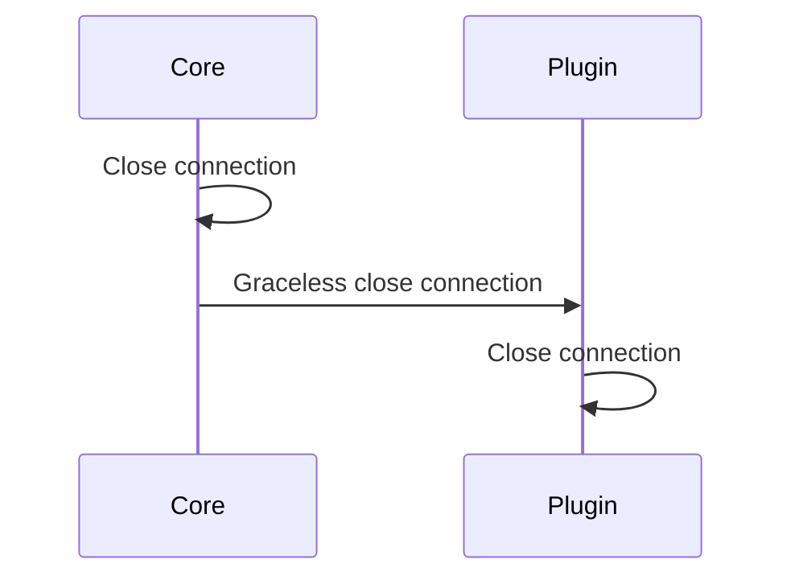

- **Graceful**: orbiter sends a `GracefulCloseConnectionMessage` to remote one. Remote orbiter is able to perform some operations before connection is actually closed. Remote orbiter must send a `CloseConnectionAckMessage`, after that connection is closed. If `graceful_close_timeout` is not `None` is used to send graceless close connection if ACK is not sent. 

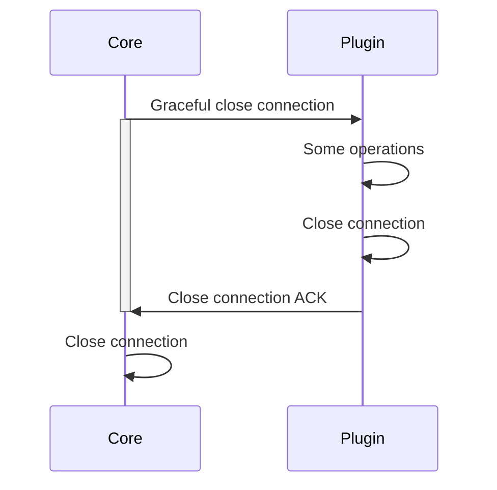

When all connections with a remote orbiter are closed, orbiter unsubscribes itself from topics in `_unsubscribe_on_full_close_bucket` field.

Hooks:

- `_on_graceless_close_connection`: called before graceless close connection request is sent
- `_on_close_connection`: called when a connection is closed
- `_on_graceful_close_connection`: called before sending graceful close connection request


### Keepalive

Keepalive mechanism allows orbiters to preserve connections during the time. Every orbiter must send a keepalive to all own linked orbiters.

An orbiter can _request_ a keepalive using `send_keepalive_request` method, which sends a `KeepaliveRequestMessage`.

```mermaid
sequenceDiagram
    Orbiter 1->>Orbiter 2: Keepalive request
    Orbiter 2->>Orbiter 1: Keepalive
```

Keepalive are sent using `KeepaliveMessage` messages. You can manually send a keepalive using `send_keepalive` method.

In addiction, `send_all_keepalive_based_on_connections` and `send_keepalive_based_on_connections_and_threshold` are provided.
`send_all_keepalive_based_on_connections` sends a keepalive to all remote orbiters which have an opened connection, 
instead `send_keepalive_based_on_connections_and_threshold` sends a keepalive to all remote orbiters which have an opened connection 
only if it is in range `send_keepalive_before_timelimit` seconds before remote orbiter considers it _dead_.

You can know which are dead remote orbiters thanks to `dead_remote_identifiers` property.

Main related fields:

- `_others_considers_me_dead_after`
- `_remote_keepalive_request_topics`
- `_remote_keepalive_topics`
- `_last_seen`
- `_last_keepalive_sent`

Hooks:

- `_on_keepalive_request`: called on keepalive request, before response
- `_on_keepalive`: called on inbound keepalive

### Loop

Every orbiter has an internal loop which performs periodically operations. Loop can be avoided setting `with_loop=False`.

Loop is stopped when `stop()` method is called, but you can stop it prematurely using `_stop_loop_controller.set()`. 
If you want to pause loop, you must `set` and `clear`: `_pause_loop_controller`.

Additionally to hooks, the following operations (already discussed) are executed in parallel:

- `_on_loop_iteration`
- `close_unused_connections`
- `discard_expired_pending_requests`
- `force_close_connection_for_out_to_timeout_pending_graceful_close_connection`
- `send_keepalive_based_on_connections_and_threshold`

Hooks:

- `_on_loop_start`: called on loop start
- `_on_new_loop_iteration`: called before every loop iteration
- `_on_loop_iteration_end`: called at the end of every loop iteration
- `_on_loop_iteration`: called during every loop iteration

