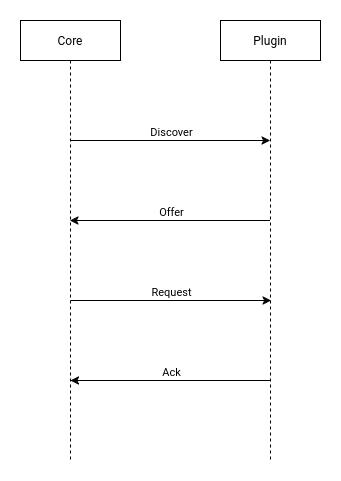

# Brainstorming

Author: Nicola Ricciardi

## Requirements

*py-busline* which is an agnostic eventbus, so it is a distributed-ready eventbus. This should allow us to share messages using different technologies, e.g. local share, MQTT and so on.

## Base concepts

*Starting point*: Orbitalis is **distributed-ready, plugin-oriented, micro-kernel architecture**.

Obviously, there are **core**s and **plugin**s which share information together using *py-busline*.

Different to canonical micro-kernel architecture in which there is only one core, in Orbitalis could be present **more than one cores** (and, obviously, more than one plugins).

Cores and plugins have a **standalone lifecycle**, therefore it is not needed to have *always* active cores and plugins.

To summarize, **Orbitalis is a *framework* in which more cores and plugins live together cooperating to achieve one or more tasks**.

We can friendly refer to cores and plugins using *orb*.

> [!IMPORTANT]
> In this version we suppose a secure environment without "evil orbs".  

## Overview

Given that orbs can be added to system in any moment, we must ensue a resilient connection system between them.

Orbitalis is **plugin-oriented**, therefore cores must request to plugins to connect to themselves.

Plugins can serve more than one cores based on their configuration.

Cores can start without required plugins.

### Initial handshaking

Initial handshaking between core and plugin is **DHCP-like**, i.e. it follows exactly DHCP phases.

Obviously, given that more cores could send discover message at the same time, we must handle concurrency (e.g. reserving a slot, timeout, ...) 

### Connection management

#### Heartbeat

In order to ensure that a plugin serves its cores, it can send periodically an **heartbeat** to cores or it must provide a "route" to obtain information about its state.

#### Connection Termination

**Graceful** and **Non-graceful**.

## Configurations

Both cores and plugins have a configuration.

**Core configuration** specifies:

- Which plugins are required in term of *IDs*, number for each type
- Optional plugins
- Blacklist and whitelist of plugins
- Plugin preferences

**Plugin configuration** specifies:

- How many cores can serve
- Whitelist and blacklist of cores
- Core preferences

## Security problems

Currently there are no security checks (e.g. no login) and we trust ID shared by orbs.

## Evolution

Is this strict separation between cores and plugins concepts really useful?

We could uniform cores and plugins in entities which are able to provide a functionality requiring a set of other entities to work; obviously this is not a micro-kernel architecture, but now there is not a structured system (i.e. having ACK) to share information between cores and between plugins. 

